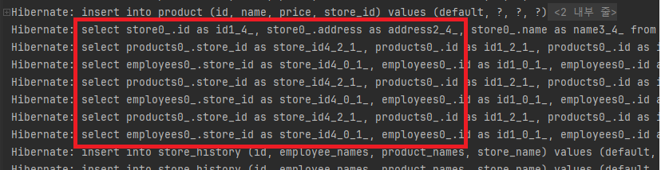
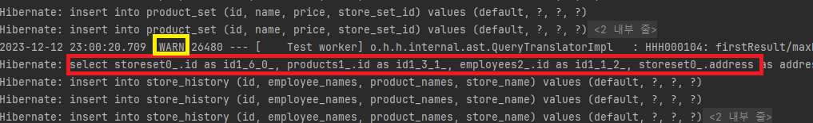
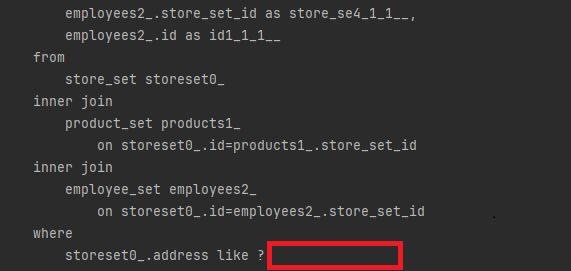
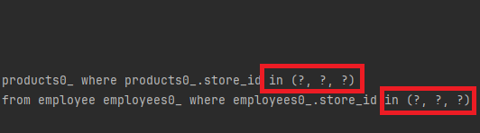
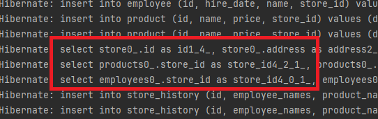

# Spring Batch에서 JPA 사용시 발생하는 N+1 문제

Spring Batch를 사용하면서 JPA를 통해 데이터를 처리할 때, 만날 수 있는 N+1 쿼리 문제에 대해서 해결을 위한 다양한 시도를 공유하고자 합니다.

<a href="https://blog.naver.com/sibu2005/223415287878" target="_blank"><strong>블로그 글 보러가기</strong></a>

## 문제 상황

조건에 맞는 Store를 StoreHistory로 백업하는 배치 작업에서, Store와 연관된 하위 도메인 두 개를 가져와서 배치 프로세서에서 처리하는 과정에서 N+1 쿼리가 발생하였습니다.

> N+1 문제
>
> 연관된 하위 엔티티에 접근할 때 각각 조회 쿼리가 발생하는 문제



## 문제를 해결하기 위한 시도

### Fetch Join 사용

일반적으로 N+1 문제를 해결하기 위해 Fetch Join을 사용하게 되는데 이때 하위 엔티티를 동시에 2개 가져오려고 하면 MultipleBagFetchException이 발생하게 됩니다.

MultipleBagFetchException은 Hibernate가 두 개 이상의 리스트(List) 형태의 컬렉션을 동시에 가져오려 할 때 발생하는데, 결과 집합이 예상보다 커지고, 데이터 중복이 발생할 수 있기 때문입니다.

밑에 표는 부모 엔티티인 "Store"가 자식 엔티티인 "Product"와 "Employee"를 각각 2개 가지고 있을 때, 카테시안 곱(Cartesian Product)이 발생한 결과집합입니다.

> 카테시안 곱(Cartesian Product)
>
> SQL에서 두 테이블을 조인할 때, 한 테이블의 모든 행이 다른 테이블의 모든 행과 결합되는 현상을 말합니다.

|부모 | 자식1 | 자식2|
|------|---|---|
|Store|Product1|Employee1|
|Store|Product1|Employee2|
|Store|Product2|Employee1|
|Store|Product2|Employee2|

Store가 4개가 중복된 것을 확인할 수 있습니다.

이런 상황에서 List 대신 Set을 사용하여 MultipleBagFetchException을 우회할 수 있습니다.

여기서 중복을 허용하지 않는 Set을 사용하게되면 중복된 결과가 제거되고 하이버 네이트는 중복없이 한 번씩만 처리하게 됩니다. 이러한 최적화로 복잡한 쿼리에서 MultipleBagFetchException 발생 가능성을 줄여줍니다.

```java
@Entity
public class Store {
    // ...

    @OneToMany(mappedBy = "storeSet", cascade = ALL)
    private Set<ProductSet> products = new LinkedHashSet<>();

    @OneToMany(mappedBy = "storeSet", cascade = ALL)
    private Set<EmployeeSet> employees = new LinkedHashSet<>();

    // ...
}
```



결과로 쿼리가 한번만 실행되었습니다. 그러나 경고도 같이 뜬 것을 볼 수 있습니다.

> o.h.h.internal.ast.QueryTranslatorImpl   : HHH000104: firstResult/maxResults specified with collection fetch; applying in memory!

위 경고는 특정 쿼리에서 컬렉션을 fetch하는 동안 페이징(paging)을 적용하려고 시도했을 때 나타나게 됩니다.

Spring Batch에서는 데이터를 페이징해서 일정한 크기(chunk size)로 나누는데 여기에 Fetch join을 사용했기 때문에 해당 경고가 뜬 것입니다.

이 경우 쿼리 결과를 전부 메모리에 적재한 뒤 어플리케이션 레벨에서 페이징 작업을 수행하게 됩니다. 쿼리에서도 limit 절이 포함되지 않는 것을 확인할 수 있습니다.



이로 인해 많은 데이터를 다룰 때 메모리 부담이 증가하게 되며, 성능 저하로 이어질 수 있습니다.

### Batch Fetch Size 사용

Fetch join 대신 Batch Fetch Size 조절을 통해서 N+1 문제를 효과적으로 관리할 수 있습니다.

Batch Fetch Size를 개별 엔티티 레벨과 전역 레벨에서 설정할 수 있으며, 개별 엔티티를 사용이 더 높은 우선순위를 가집니다.

```java
// 개별 엔티티 설정
@BatchSize(size = 10)
@Entity
public class Store {
}
```

```properties
# 전역 설정
spring.jpa.properties.hibernate.default_batch_fetch_size=10
```

Batch Fetch Size를 사용하게 되면 연관된 엔티티를 가져올 때 지정된 크기만큼의 데이터를 IN 쿼리로 한 번의 쿼리로 가져오게 됩니다.

예를들어 Store 엔티티가 여러 Product 엔티티와 연관되어 있고 batch fetch size가 10으로 설정된 경우, Store 엔티티와 관련된 Product 엔티티들을 로드할 때 한 번에 최대 10개의 Product 엔티티를 불러오는 IN 쿼리를 생성하게 됩니다.



#### JpaPagingItemReader 사용시 주의점

Batch Fetch Size는 연관된 엔티티나 컬렉션을 로드할 때 일정 수의 엔티티를 한 번에 가져오도록 최적화하는 설정이며, 현재 진행 중인 트랜잭션 내에서 유효합니다.

일반적인 PagingItemReader의 경우, 트랜잭션을 Chunk에 맡김으로써 Chunk size의 처리가 끝날 때까지 하나의 트랜잭션으로 유지됩니다. 그래서 해당 설정이 전체 Chunk에 대해 일관되게 적용되어 최적화 효과를 얻을 수 있습니다.

그러나 JpaPagingItemReader는 페이징 처리를 위해 Reader 내부에서 각 페이지마다 별도의 트랜잭션을 사용하고 종료합니다. 이렇게 각 페이지마다 새로운 트랜잭션을 시작하고 종료하는 방식은 Batch Fetch Size 설정이 각 트랜잭션에 대해 개별적으로 적용되고, 트랜잭션이 종료될 때마다 초기화되는 결과를 가져옵니다.

이 경우, 각 페이지 로드에만 설정이 적용되므로 전체적인 배치 최적화 효과를 얻기 어렵습니다. 더욱이, JpaPagingItemReader의 사용은 IN 쿼리 최적화가 적용되지 않는 상황이 발생하게 됩니다 이는 Batch Fetch Size 설정이 효과적으로 작동하려면 연속된 트랜잭션 내에서 실행되어야 하는데, JpaPagingItemReader가 각 페이지 로딩 시 트랜잭션을 별도로 처리하기 때문입니다.

이 문제를 해결하기 위해 JpaPagingItemReader 내부의 트랜잭션을 제거하여 Chunk에게 트랜잭션을 맡기는 방식이 있습니다.

> 내부에 트랜잭션을 제거하여 문제를 해결한 포스트   
> 링크: <a href="https://jojoldu.tistory.com/414" target="_blank"><strong>https://jojoldu.tistory.com/414 </strong></a>



## Batch Fetch Size를 통한 해결

### 효과

초기에 N+1 문제가 발생했을 때, 처리해야 할 데이터가 단 7개임에도 불구하고 총 7개의 쿼리가 필요했습니다. 만약 처리해야 할 데이터가 100개라면, 이 문제는 101개의 쿼리가 필요하게 되어 성능에 큰 부담을 주게 됩니다.

그러나 Batch Fetch Size 설정을 적용한 후에는 동일한 데이터 처리에 대해 이제는 단 3개의 쿼리만 발생하게 되었습니다.

### 주의점

Batch Fetch Size 값을 너무 높게 설정하면 많은 양의 데이터를 메모리에 로드하게 되면서 메모리 부족(OOM) 문제가 발생할 수 있습니다.

또한, 한 번의 쿼리에 많은 in 조건을 사용하면 데이터베이스 서버에 부담을 주어, 응답 시간이 증가하고 전반적인 시스템 성능이 저하될 수 있습니다.

메모리, 데이터베이스 성능, 요구 사항을 고려해서 성능 테스트를 통해 알맞는 값을 찾아야 할 것 같습니다.

## 참조

<a href="https://docs.spring.io/spring-batch/docs/current/api/org/springframework/batch/item/database/JpaPagingItemReader.html" target="_blank"><strong>스프링 배치 공식문서 - JpaPagingItemReader</strong></a>

<a href="https://jojoldu.tistory.com/414" target="_blank"><strong>기억보단 기록을 - Spring Batch JPA에서 N+1 문제 해결</strong></a>

<a href="https://tecoble.techcourse.co.kr/post/2020-10-21-jpa-fetch-join-paging/" target="_blank"><strong>
Tecoble - JPA에서 Fetch Join과 Pagination을 함께 사용할때 주의하자</strong></a>

<a href="https://www.baeldung.com/java-hibernate-multiplebagfetchexception" target="_blank"><strong>
A Guide to MultipleBagFetchException in Hibernate</strong></a>


