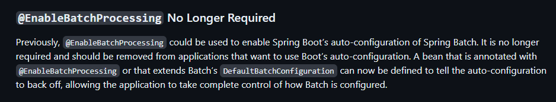
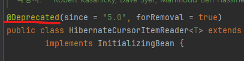
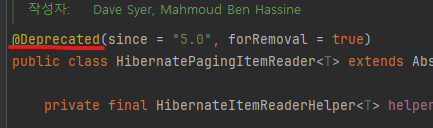
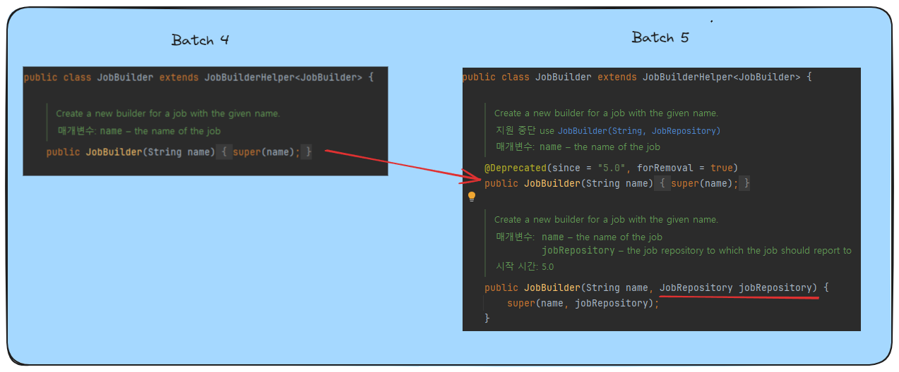
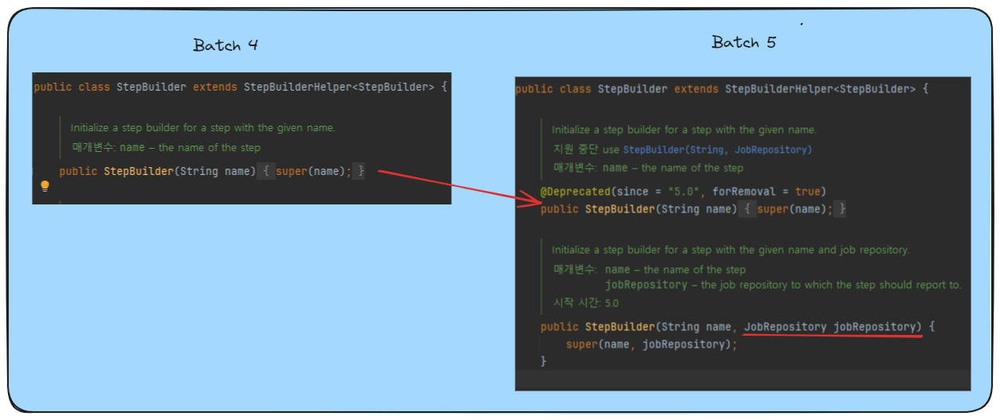
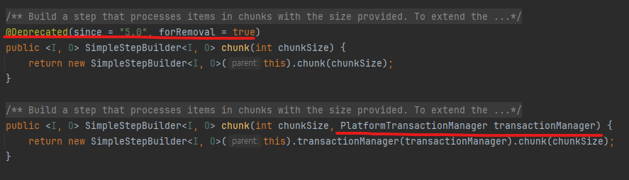
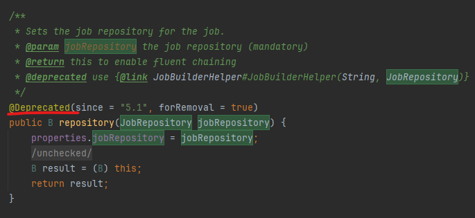

# Spring Batch에서 JPA 사용시 발생하는 N+1 문제 - JDK 17, Batch 5.0 이상 변경점 

기존 Spring Batch에서 JPA 사용시 발생하는 N+1 문제에 대해서 JDK 17, Spring Batch 5.0 이상 버전에서 발생하는 변경점을 확인하고자 합니다.

<a href="https://woosungkim0123.github.io/posts/batch_n_1/" target="_blank"><strong>이전 Spring Batch에서 JPA 사용시 발생하는 N+1 문제 블로그 글 </strong></a>  

<a href="https://github.com/woosungkim0123/spring-batch-deep-dive/tree/main/n_1_v11" target="_blank"><strong>이전 Spring Batch에서 JPA 사용시 발생하는 N+1 문제 코드</strong></a>

<a href="https://woosungkim0123.github.io/posts/batch_n_1_v17/" target="_blank"><strong>Spring Batch에서 JPA 사용시 발생하는 N+1 문제 - JDK 17, Batch 5.0 이상 변경점 블로그 글 </strong></a>

## Batch 5.0 이상 변경점

기존 코드에서 필요하다고 생각되는 부분만 다루었습니다. 자세한 정보를 보시려면 <a href="https://github.com/spring-projects/spring-batch/wiki/Spring-Batch-5.0-Migration-Guide" target="_blank"><strong>링크</strong></a>를   참조해주세요.

### Database 스키마 수정

Batch 5.0 이전 버전의 스키마를 그대로 사용하면 에러가 발생합니다.

#### 1. JOB_CONFIGURATION_LOCATION

BATCH_JOB_EXECUTION 테이블 JOB_CONFIGURATION_LOCATION 열이 더이상 사용되지 않습니다.


5.0버전에서 해당 칼럼을 사용하는 Spring Batch의 유일한 부분인 JSR-352가 채택 부족으로 구현이 제거됨에 따라 사용처가 없어졌습니다. 


#### 2. BATCH_JOB_EXECUTION_PARAMS의 열 변경

<a href="https://github.com/spring-projects/spring-batch/issues/3960" target="_blank"><strong> Issue #3960 </strong></a> 에서 Spring Boot 사용자에게 친숙한 Parameter 변경 제안이 있었는데 이를 반영한 것으로 보입니다.

```SQL
CREATE TABLE BATCH_JOB_EXECUTION_PARAMS  (
    JOB_EXECUTION_ID BIGINT NOT NULL ,
    --	TYPE_CD VARCHAR(6) NOT NULL , -- 제거
    --	KEY_NAME VARCHAR(100) NOT NULL , -- 제거
    --	STRING_VAL VARCHAR(250) , -- 제거
    --  DATE_VAL DATETIME(6) DEFAULT NULL , -- 제거
    --	LONG_VAL BIGINT , -- 제거
    --	DOUBLE_VAL DOUBLE PRECISION , -- 제거
    PARAMETER_NAME VARCHAR(100) NOT NULL , -- **추가**
    PARAMETER_TYPE VARCHAR(100) NOT NULL , -- **추가**
    PARAMETER_VALUE VARCHAR(2500) , -- **추가**
    IDENTIFYING CHAR(1) NOT NULL,
    constraint JOB_EXEC_PARAMS_FK foreign key (JOB_EXECUTION_ID)
    references BATCH_JOB_EXECUTION(JOB_EXECUTION_ID)
```

### EnableBatchProcessing

Boot 3.0 이전에는 자동 구성을 활성화 하기 위해 @EnableBatchProcessing을 사용했습니다. 그러나 3.0 부터는 Spring Boot의 자동 구성을 사용하려면 제거해야합니다.

@EnableBatchProcessing이나 DefaultBatchConfiguration을 확장하는 빈을 정의하면 Spring Boot의 자동 구성이 비활성화되고, 애플리케이션은 Spring Batch를 완전히 제어할 수 있습니다



@EnableBatchProcessing에 새로운 속성이 추가되어, 어떤 구성 요소와 매개변수를 사용하여 Batch 인프라 빈을 구성할지 지정할 수 있습니다. 

`@EnableBatchProcessing(dataSourceRef = "dataSource1, transactionManagerRef = "transactionManger1")`

### Hibernate Reader Deprecated

HibernateCursorItemReader, HibernatePagingItemReader, HibernateItemWriter가 Deprecated 되었습니다. (관련 Builder 클래스 포함)





ps. n_1_v17 프로젝트에서 HibernatePagingItemReader를 사용하는 예시 코드를 제거하였습니다.

### JobBuilder, StepBuilder 사용 권장

JobBuilderFactory, StepBuilderFactory가 deprecated 되고 JobBuilder, StepBuilder 사용을 권장하고 있습니다.


#### JobBuilderFactory, StepBuilderFactory를 deprecated 시킨 이유

<a href="https://github.com/spring-projects/spring-batch/issues/4188" target="_blank"><strong> Issue #4188 </strong></a>

1. JobBuilderFactory는 내부적으로 JobRepository를 생성하고 설정하는데, 이 과정이 암시적으로 이루어지다보니 많은 사용자들, 특히 새로운 사용자들에게 혼란을 줄 수 있다고 했습니다.

2. 하나의 애플리케이션 내에서 여러 개의 JobRepository를 사용하는 경우들이 많은데 이를 변경하려면 BatchConfigurer라는 커스텀 클래스를 만들어서 JobBuilderFactory에 다른 JobRepository를 설정해야 하다보니 간편함과는 거리가 멀다고 했습니다.

위와 같은 이유 때문에 Spring Batch에서는 JobBuilderFactory의 사용을 권장하지 않고, 대신 더 명시적인 JobBuilder의 사용을 선호하게 되었다고 합니다.

#### JobRepository와 TransactionManager의 사용 방식이 명시적으로 변경

JobBuilder, StepBuilder에 기존에 name만 받던 생성자를 JobRepository도 추가로 받도록 변경되었습니다.





chunk 설정을 함에 있어 size 뿐만 아니라 transactionManager도 함께 받도록 변경하였습니다.



Batch 5.1 버전에서는 변경도 deprecated 시킴으로써 생성자를 통해 주입 받으면 이후 변경할 수 없게 되었습니다.

더 명시적이고, 안정적인 방식으로 JobRepository와 TransactionManager를 관리하도록 한 것으로 보입니다.



## Batch 코드 비교

Reader, Processor, Writer는 변경사항이 없어 생략했습니다.

```java
// v4
public class CustomJpaPagingReaderBatch {
    // ...
    private final JobBuilderFactory jobBuilderFactory; // 5.0에서 deprecated
    private final StepBuilderFactory stepBuilderFactory; // 5.0에서 deprecated
    // ...
    
    @Bean(name = JOB_NAME)
    public Job job() {
        return jobBuilderFactory.get(JOB_NAME) // 5.0에서 jobBuilderFactory -> JobBuilder
                .start(step())
                .build();
    }

    @Bean(name = STEP_NAME)
    public Step step() {
        return stepBuilderFactory.get(STEP_NAME) // 5.0에서 stepBuilderFactory -> StepBuilder
                .<Store, StoreHistory>chunk(chunkSize) // 5.00에서 chunkSize, transactionManager 주입
                .reader(reader.reader(ADDRESS_PARAM, chunkSize))
                .processor(processor)
                .writer(writer)
                .build();
    }
}

// v5
public class CustomJpaPagingReaderBatch {
    // ...
    private final JobRepository jobRepository; // 주입 1
    private final PlatformTransactionManager transactionManager; // 주입 2
    // ...
    
    @Bean(name = JOB_NAME)
    public Job job() {
        return new JobBuilder(JOB_NAME, jobRepository) // 변경 사항1: JobBuilder 사용, jobRepository 주입
                .start(step())
                .build();
    }
    
    @Bean(name = STEP_NAME)
    public Step step() {
        return new StepBuilder(STEP_NAME, jobRepository) // 변경 사항2: StepBuilder 사용, jobRepository 주입
                .<Store, StoreHistory>chunk(chunkSize, transactionManager) // 변경 사항3: transactionManager 주입
                .reader(reader.reader(ADDRESS_PARAM, chunkSize))
                .processor(processor)
                .writer(writer)
                .build();
    }
}
```

## 참조

<a href="https://github.com/spring-projects/spring-boot/wiki/Spring-Boot-3.0.0-M5-Release-Notes#enablebatchprocessing-no-longer-required" target="_blank"><strong>Spring-Boot-3.0.0-M5-Release-Notes</strong></a>

<a href="https://github.com/spring-projects/spring-batch/wiki/Spring-Batch-5.0-Migration-Guide" target="_blank"><strong>Spring Batch 5.0 Migration Guide</strong></a>
